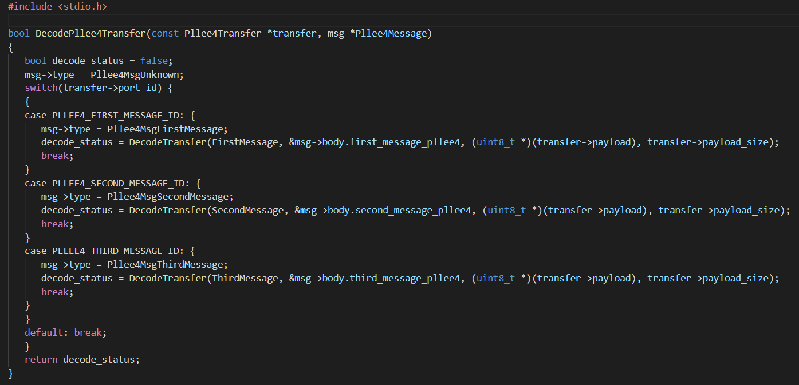

# C code generator

C code generator using [cfile](https://github.com/cogu/cfile)

Generates C code for cases such as decoding or encoding of messages especially when using generated message such as protocol buffer

## To install dependencies
```
sudo apt-get install python3
sudo apt-get install python3-pip
sudo apt-get install python3-venv
```
## To run in virtual environment
```
sudo python3 -m venv env
source env/bin/activate
python3 -m pip install -r requirements.txt
```

## To run example from cfile
```
python3 src/cfile_example.py
```

## To run switch_case_example
```
python3 src/switch_case_example.py
```

## To exit virtual environment
```
deactivate
```

## Generated code
The generated code would be under the folder named "generated_code"


